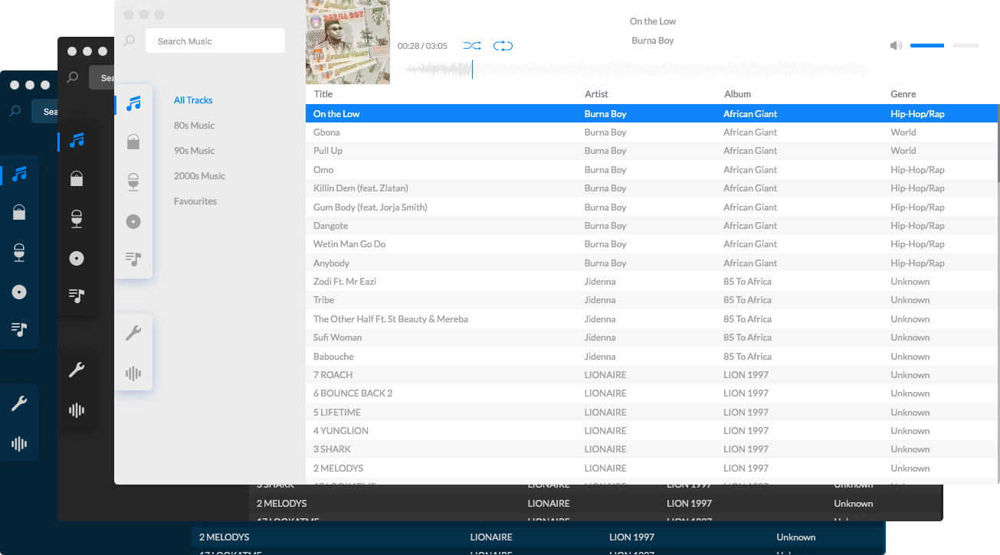

# SoundPlay </img>

The Next Gen Minimalist Cross-Platform Sound Player




## Contributing

> **Note**: The contributing guidlines would be strictly followed after the official v0.2.x release.

Please check the [contributing docs](./docs/CONTRIBUTING.md)

---

## Installation :computer:

> **Note**: After the v.0.2.2 (Aplha) release, prebuilt binaries would be available for MacOS, Linux and Windows [here](https://github.com/Zero-1729/soundplay/releases)

At the moment no prebuilt binaries are available, however, you can follow the build instructions below to manually package it.

---

#### Build Setup

``` bash
# install dependencies
$ npm install

# build Soundplay Electron App
# replace 'platform' with 'mac', 'win' or 'linux'
$ npm run build:platform
```

#### Dev setup

```
# Clone the repo
$ git clone https://github.com/Zero-1729/soundplay

# enter folder and install dependencies
$ cd soundplay && npm install

# Run Soundplay in dev mode with hot reload
$ npm run dev
```

---

MIT &copy; 2020 Zero-1729
